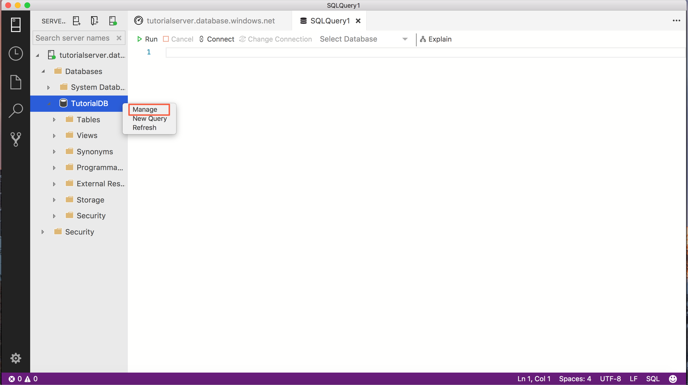
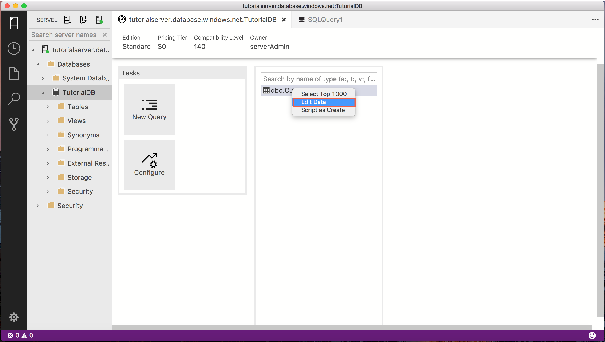
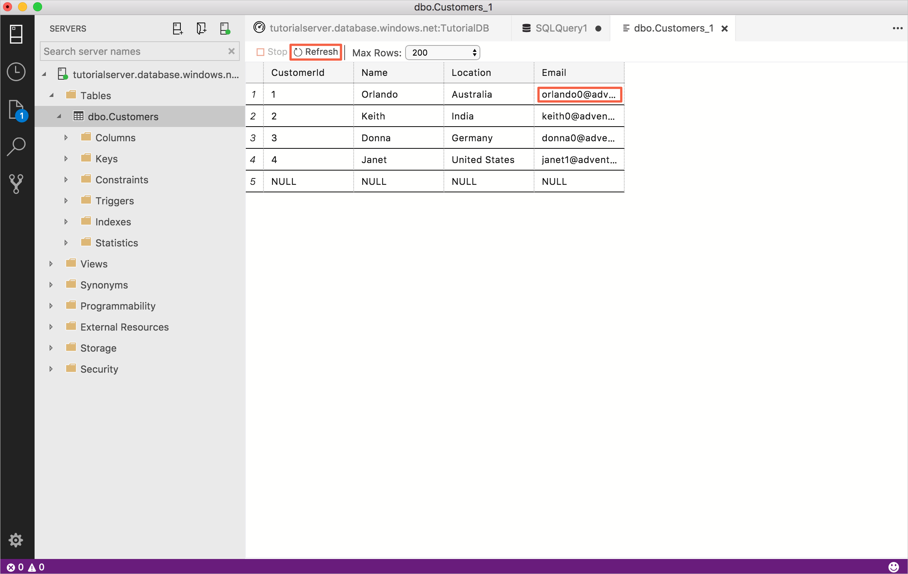
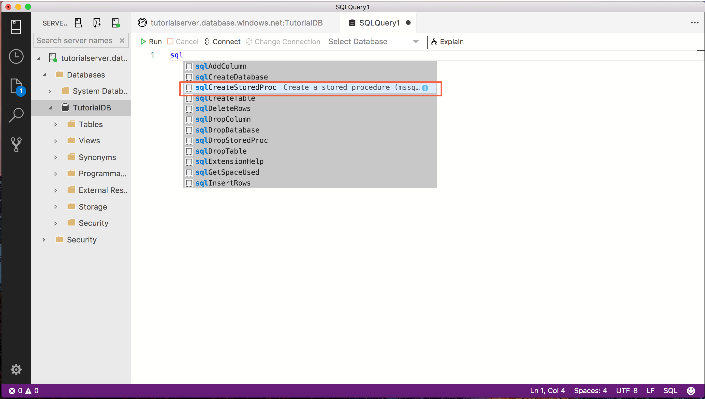
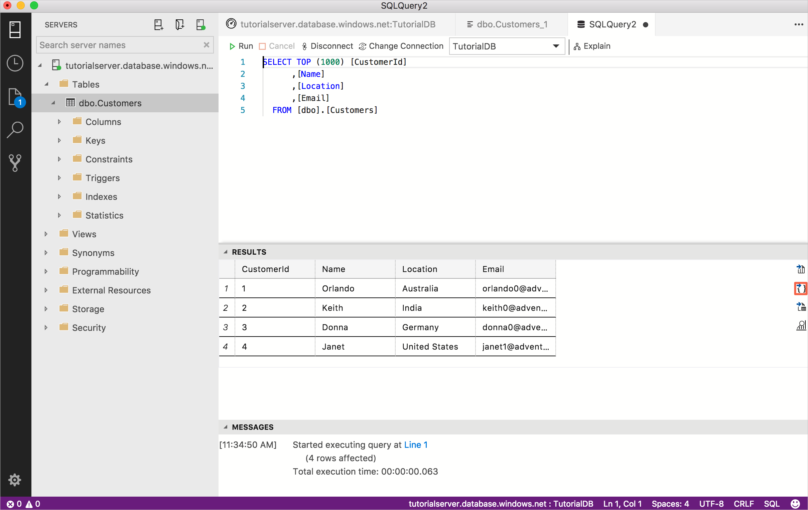
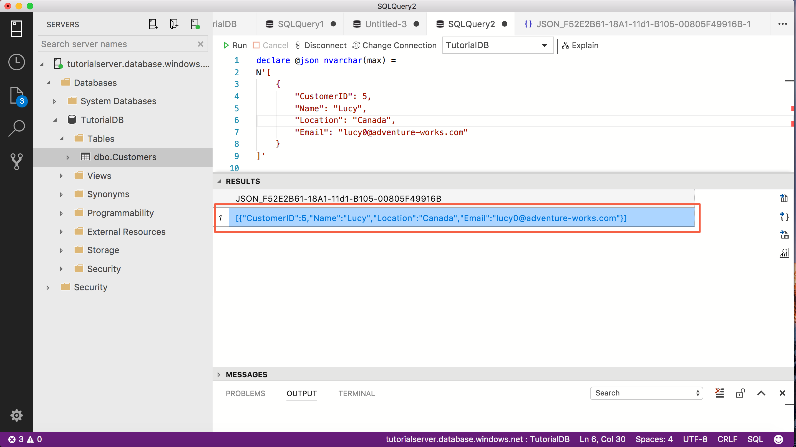

# Working with T-SQL using [!INCLUDE[name-sos](../includes/name-sos-short.md)]

Creating and running queries, stored procedures, scripts, etc. are the core tasks of database professionals. This tutorial walks through the key features in [!INCLUDE[name-sos](../includes/name-sos-short.md)] that simplify using T-SQL.

In this tutorial, you learn how to use [!INCLUDE[name-sos-short](../includes/name-sos-short.md)] to:
> [!div class="checklist"]
> * Search database objects
> * Edit table data 
> * Use snippets to quickly write T-SQL
> * View database object details using *Peek Definition* and *Go to Definition*


## Prerequisites

This tutorial requires the *TutorialDB* database. To create the *TutorialDB* database, complete one of the following quickstarts:

- [Connect and query SQL Server using [!INCLUDE[name-sos-short](../includes/name-sos-short.md)]](get-started-sql-server.md)
- [Connect and query Azure SQL Database using [!INCLUDE[name-sos-short](../includes/name-sos-short.md)]](get-started-sql-database.md)
- [Connect and query SQL Data Warehouse using [!INCLUDE[name-sos-short](../includes/name-sos-short.md)]](get-started-sql-dw.md)


## Quickly locate a database object and perform a common task

[!INCLUDE[name-sos-short](../includes/name-sos-short.md)] provides a search widget to quickly find database objects. The results list provides a context menu for common tasks relevant to the selected object, such as *Edit Data* for a table.

1. Open the SERVERS sidebar (**CTRL+G**), expand **Databases**, and select **TutorialDB**. 

1. Open the *TutorialDB Dashboard* by selecting **Manage** from the context menu.

   

1. Locate the *Customers* table by typing *cus* in the search widget.
1. Right-click **dbo.Customers** and select **Edit data**.

   

1. Edit the **Email** column in the first row, type *jared@vsdata.io*, and click outside the cell to save the change.

   

## Use T-SQL snippets and IntelliSense to create a stored procedure

### Use snippets in [!INCLUDE[name-sos-short](../includes/name-sos-short.md)]

1. Open a new query editor by pressing **CTRL + N**.

2. Type **sql** in the editor, arrow down to **sqlCreateStoredProcedure**, and press the *Tab* key to load the new stored procedure snippet.

   

3. Type *getCustomer* and all *StoredProcedureName* entries will change to *getCustomer*. 

   

4. Press *Tab* and then type *dbo* to replace the *SchemaName* entries.

5. Replace  ```@param1...``` with:

   ```sql
       @ID int
   ```

### Use IntelliSense in [!INCLUDE[name-sos-short](../includes/name-sos-short.md)]
??THIS DOES NOT WORK AND NEEDS HELP!!??
1. Type in the following SELECT statement in the body of procedure. 

> [!TIP]
> Type *SELECT FROM dbo.Customers c*, and complete the rest as IntelliSense guides you.

   ```sql
    SELECT  c.CustomerID, 
            c.Name, 
            c.Location, 
            c.Email
    FROM dbo.Customers c
    WHERE c.CustomerID = @ID
    FOR JSON PATH
   ```

   

7. Delete the example arguments in the EXECUTE statement. The final statement should be: ```EXECUTE dbo.getCustomer 1```.


1. To create the stored procedure and give it a test run, press **F5**.

## Use Peek Definition and Go to Definition 

1. Open a new editor by pressing **CTRL + N**. 

2. Type and select **sqlCreateStoredProcedure** from the snippet suggestion list. Type in **setCustomer** for **StoredProcedureName** and **dbo** for **SchemaName**
3. Replace the @param lines with the following parameter definition:

   ```sql
       @json_val nvarchar(max)
   ```

4. Replace the body of the stored procedure with the following:
   ```sql
   -- body of the stored procedure
   INSERT INTO dbo.Customers
   ```

5. Right-click **dbo.Customers** and select **Peek Definition**.

   

6. By referencing the table defintion in the peek definition, complete the following insert statement.??WHAT EXACTLY AM I DOING HERE - JUST LOOKING OR DOES THIS HELP ME CREATE THE STATEMENT??

   ```sql
   INSERT INTO dbo.Customers (CustomerID, Name, Location, Email)
       SELECT CustomerID, Name, Location, Email
       FROM OPENJSON (@json_val)
       WITH(   CustomerID int, 
               Name nvarchar(50), 
               Location nvarchar(50), 
               Email nvarchar(50)
   ```
7. The final statement should be:

   ```sql
   -- Create a new stored procedure called 'setCustomer' in schema 'dbo'
   -- Drop the stored procedure if it already exists
   IF EXISTS (
   SELECT *
       FROM INFORMATION_SCHEMA.ROUTINES
       WHERE SPECIFIC_SCHEMA = N'dbo'
       AND SPECIFIC_NAME = N'setCustomer'
   )
   DROP PROCEDURE dbo.setCustomer
   GO
   -- Create the stored procedure in the specified schema
   CREATE PROCEDURE dbo.setCustomer
       @json_val nvarchar(max) 
   AS
       -- body of the stored procedure
       INSERT INTO dbo.Customers (CustomerID, Name, Location, Email)
       SELECT CustomerID, Name, Location, Email
       FROM OPENJSON (@json_val)
       WITH(   CustomerID int, 
               Name nvarchar(50), 
               Location nvarchar(50), 
               Email nvarchar(50)
       )
   GO
   ```

8. Press **F5** and execute the script.

## Save query results as JSON

In this step, we walkthrough how the **Save as JSON** option makes developing and testing application login in stored procedures and using JSON as a data format in applications.

1. **SELECT TOP 1000 Rows** from the *dbo.Customers* table.

2. Select the first row in the results view and click **Save as JSON**.  1. Click **Save**, and it opens the highlighted row in JSON format.

   

4. Select the JSON data and copy it.

5. Open a new query for *TutorialDB* and paste the JSON data into the new query editor. 

6. Complete the following test script using the json data as a template in the previous step. Modify the values for *CustomerID*, *Name*, *Location*, and *Email*.

   ```sql
   -- example to execute the stored procedure we just created
   declare @json nvarchar(max) =
   N'[
       {
           "CustomerID": 5,
           "Name": "Lucy",
           "Location": "Canada",
           "Email": "lucy0@adventure-works.com"
       }
   ]'

   EXECUTE dbo.setCustomer @json_val = @json
   GO

   EXECUTE dbo.getCustomer @ID = 5
   ```

7. Execute the script by pressing *F5**. The script inserts a new customer and returns the new customer's information in JSON format. Click the result to open a formatted view.

   

## Next Steps
In this tutorial, you learned how to:
> [!div class="checklist"]
> * Quick search schema objects
> * Edit table data 
> * Writing T-SQL script using snippets
> * Learn about database object details using Peek Definition and Go to Definition

Next, learn how to use X, try this tutorial: 
> [!div class="nextstepaction"]
> [What article is next in sequence](tutorial-monitoring-sql-server.md)