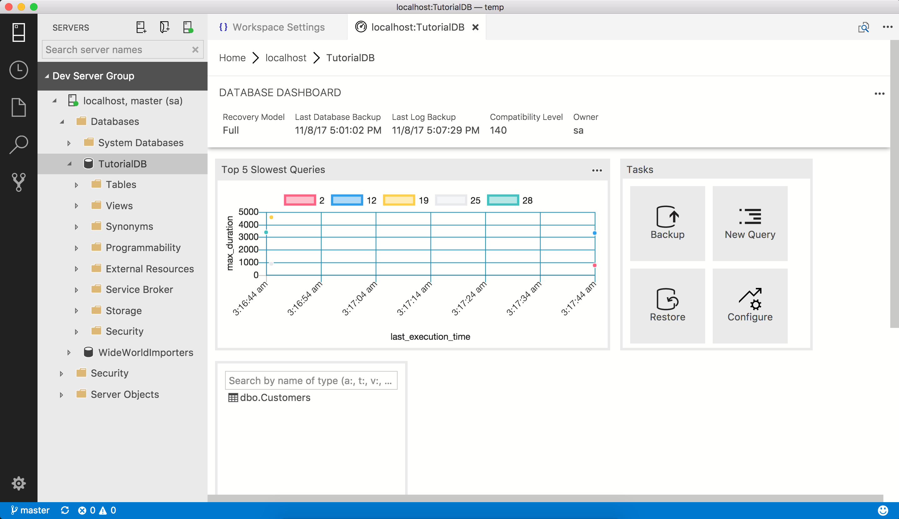
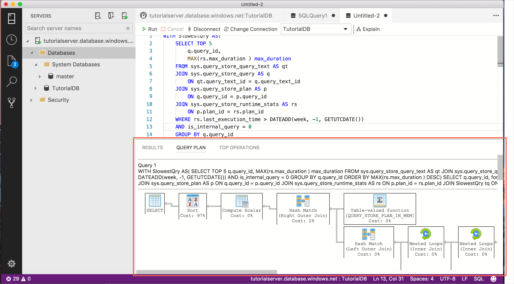

# Tutorial: Add the pre-built *five slowest queries* widget to the database dashboard

This tutorial demonstrates the process of adding one of [!INCLUDE[name-sos](../includes/name-sos-short.md)]'s built-in insight widgets to the *database dashboard* to quickly view a database's five slowest queries. You also learn how to view the details of the slow queries and query plans using [!INCLUDE[name-sos](../includes/name-sos-short.md)]'s features. During this tutorial, you learn how to:

> [!div class="checklist"]
> * Enable Query Store on a database
> * Add a pre-built insight widget to the database dashboard
> * View details about the database's slowest queries
> * View query execution plans for the slow queries

[!INCLUDE[name-sos](../includes/name-sos-short.md)] includes several insight widgets out-of-the-box. This tutorial shows how to add the *query-data-store-db-insight* widget, but the steps are basically the same for adding any widget.

## Prerequisites

This tutorial requires the SQL Server or Azure SQL Database *TutorialDB*. To create the *TutorialDB* database, complete one of the following quickstarts:

- [Connect and query SQL Server using [!INCLUDE[name-sos-short](../includes/name-sos-short.md)]](quickstart-sql-server.md)
- [Connect and query Azure SQL Database using [!INCLUDE[name-sos-short](../includes/name-sos-short.md)]](quickstart-sql-database.md)


## Turn on Query Store for your database

The widget in this example requires *Query Store* to be enabled so run the following T-SQL statement against your database:

   ```sql
    ALTER DATABASE TutorialDB SET QUERY_STORE = ON
   ```

## Add an insight widget to your Database Dashboard

To add an insight widget to your dashboard, edit the *dashboard.database.widgets* setting in your *User Settings* file.

1. Open *User Settings* by pressing **Ctrl+Shift+P** to open the *Command Palette*.
2. Type *settings* in the search box and from the available settings files, select **Preferences: Open User Settings**.

   

2. Type *dashboard* in the settings search box and locate **dashboard.database.widgets**.

   

3. To customize the **dashboard.database.widgets** setting, hover over the pencil icon to the left of the **dashboard.database.widgets** text, click **Edit** > **Copy to Settings**.

4. Using [!INCLUDE[name-sos](../includes/name-sos-short.md)]'s insight settings IntelliSense, configure *name* for the widget title, *gridItemConfig* for the widget size, and *widget* by selecting **query-data-store-db-insight** from the list as shown in the following screenshot:

   

5. Press **Ctrl+S** to save the modified **User Settings**.

6. Open the *Database dashboard* by navigating to **TutorialDB** in the *Servers* sidebar, right-click, and select **Manage**.

   

7. The insight widget appears on the dashboard: 

   


## View insight details for more information

1. To view additional information for an insight widget, click the ellipses (**...**) in the upper right, and select **Show Details**.
2. To show more details for an item, select any item in **Chart Data** list.

   

3. Right-click **query_sql_txt** in **Item Details** and click **Copy Cell**.

4. Close the **Insights** pane.

## View the query plan

1. Open a new query editor by pressing **Ctrl+N**.

2. Paste the query text from the previous steps into the editor.

3. Click **Explain**.

   

4. View the query's execution plan:

   

## View the query plan in Query Data Store

**??THIS OPENS AS TEXT FOR ME??**

1. Open the insight detail dialog again.

2. Right-click **query_plan** value and select **Copy Cell**

   

3. Press **Ctrl+N** to open a new editor.

4. Paste the copied plan into the editor.

5. Press **Ctrl+S** to save the file, and change the file extension to *.showplan.

6. The query plan opens in [!INCLUDE[name-sos](../includes/name-sos-short.md)]'s query plan viewer.

   >> ??TBD - screenshot??

## Next steps
In this tutorial, you learned how to:
> [!div class="checklist"]
> * Enable Query Store on a database
> * Add an insight widget to the database dashboard
> * View details about the database's slowest queries
> * View query execution plans for the slow queries

To learn how to build a custom insight widget, see [Build a custom insight widget](tutorial-build-custom-insight-sql-server.md).