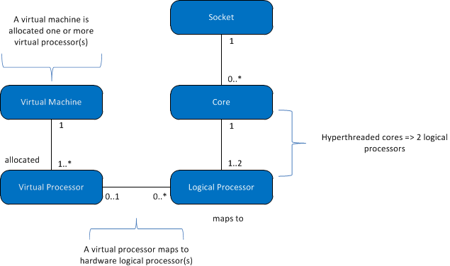

# Compute Capacity Limits by Edition of SQL Server
  This topic discusses compute capacity limits for different editions of [!INCLUDE[ssCurrent](../includes/sscurrent-md.md)] and how they differ in physical and virtualized environments with hyperthreaded processors.  
  
   
  
 The following table describes the notations being used in the above diagram:  
  
|Value|Description|  
|-----------|-----------------|  
|0..1|Zero or one|  
|1|Exactly one|  
|1..\*|One or more|  
|0..\*|Zero or more|  
|1..2|One or two|  
  
> [!IMPORTANT]  
> To elaborate further:  
>   
> 1.  A virtual machine is allocated one or more virtual processors.  
> 2.  One or more virtual processors are allocated to exactly one virtual machine.  
> 3.  Zero or one virtual processor is mapped to zero or more logical processors. When the virtual processor to logical processor mapping is: 
>     -   One-to-zero, it represents an unbound logical processor not used by the guest operating systems.  
>     -   One-to-many, it represents an overcommit.  
>     -   Zero-to-many, it represents the absence of virtual machine on the host system, so no logical processors are used by VMs.  
> 4.  A socket is mapped to zero or more cores. When the socket to core mapping is:  
>     -   One-to-zero, it represents an empty socket (no chip installed).  
>     -   One-to-one, it represents a single-core chip installed into the socket (very rare these days).  
>     -   One-to-many, it represents a multi-core ship installed into the socket (typical values are 2,4,8).  
> 5.  A core is mapped to one or two logical processors. When the core to logical processor mapping is:  
>     -   One-to-one, hyperthreading is off.  
>     -   One-to-two, hyperthreading is on.  
  
 The following definitions apply to the terms used throughout this topic:  
  
-   A thread or logical processor is one logical computing engine from the perspective of [!INCLUDE[ssNoVersion](../includes/ssnoversion-md.md)], the operating system, an application or driver.  
  
-   A core is a processor unit, which can consist of one or more logical processors.  
  
-   A physical processor can consist of one or more cores. A physical processor is the same as a processor package, or a socket.  
  
Systems with more than one physical processor or systems with physical processors that have multiple cores and/or hyperthreads enable the operating system to execute multiple tasks simultaneously. Each thread of execution appears as a logical processor. For example, if you have a computer that has two quad-core processors with hyper-threading enabled and two threads per core, you have 16 logical processors: 2 processors x 4 cores per processor x 2 threads per core. It is worth noting that:  
  
-   The compute capacity of a logical processor from a single thread of a hyperthreaded core is less than the compute capacity of a logical processor from that same core with hyperthreading disabled.  
  
-   But the compute capacity of the 2 logical processors in the hyperthreaded core is greater than the compute capacity of the same core with hyperthreading disabled.  
  
Each edition of [!INCLUDE[ssNoVersion](../includes/ssnoversion-md.md)] has two compute capacity limits:  
  
1.  A maximum number of sockets (Same as Physical processor or socket or Processor package).  
  
2.  A maximum number of cores as reported by the operating system.  
  
These limits apply to a single instance of [!INCLUDE[ssNoVersion](../includes/ssnoversion-md.md)]. They represent the maximum compute capacity that a single instance will use. They do not constrain the server upon which the instance may be deployed. In fact deploying multiple instances of [!INCLUDE[ssNoVersion](../includes/ssnoversion-md.md)] on the same physical server is an efficient way to use the compute capacity of a physical server with more sockets and/or cores than the capacity limits below.  
  
The following table specifies the compute capacity limits for a single instance of each edition of [!INCLUDE[ssCurrent](../includes/sscurrent-md.md)]:  
  
|[!INCLUDE[ssNoVersion](../includes/ssnoversion-md.md)] Edition|Maximum Compute Capacity Used by a Single Instance ([!INCLUDE[ssNoVersion](../includes/ssnoversion-md.md)][!INCLUDE[ssDE](../includes/ssde-md.md)])|Maximum Compute Capacity Used by a Single Instance (AS, RS)|  
|---------------------------------------|--------------------------------------------------------------------------------------------------------|-------------------------------------------------------------------|  
|Enterprise Edition: Core-based Licensing\*|Operating system maximum|Operating system maximum|  
|Developer|Operating system maximum|Operating system maximum|  
|Standard|Limited to lesser of 4 sockets or 24 cores|Limited to lesser of 4 sockets or 24 cores|  
|Express|Limited to lesser of 1 socket or 4 cores|Limited to lesser of 1 socket or 4 cores|  

\*Enterprise Edition with Server + Client Access License (CAL) based licensing (not available for new agreements) is limited to a maximum of 20 cores per [!INCLUDE[ssNoVersion](../includes/ssnoversion-md.md)] instance. There are no limits under the Core-based Server Licensing model.  
  
In a virtualized environment, the compute capacity limit is based on the number of logical processors, not cores, because the processor architecture is not visible to the guest applications.  For example, a server with four sockets populated with quad-core processors and the ability to enable two hyperthreads per core contains 32 logical processors with hyperthreading enabled but only 16 logical processors with hyperthreading disabled. These logical processors can be mapped to virtual machines on the server with the virtual machines’ compute load on that logical processor mapped into a thread of execution on the physical processor in the host server.  
  
You may want to disable hyperthreading when the performance per virtual processor is important. One can enable or disable hyperthreading using a BIOS setting for the processor during the BIOS setup, but it is typically a server scoped operation that will impact all workloads running on the server. This may suggest separating workloads that will run in virtualized environments from those that would benefit from the hyperthreading performance boost in a physical operating system environment.  
  
## See Also  
 [Editions and Components of SQL Server 2016](../sql-server/editions-and-components-of-sql-server-2016.md)   
 [Features Supported by the Editions of SQL Server 2016](~/sql-server/editions-and-supported-features-for-sql-server-2016.md)   
 [Maximum Capacity Specifications for SQL Server](../sql-server/maximum-capacity-specifications-for-sql-server.md)   
 [Quick-Start Installation of SQL Server 2016](http://msdn.microsoft.com/library/672afac9-364d-4946-ad5d-8a2d89cf8d81)  
  
  

