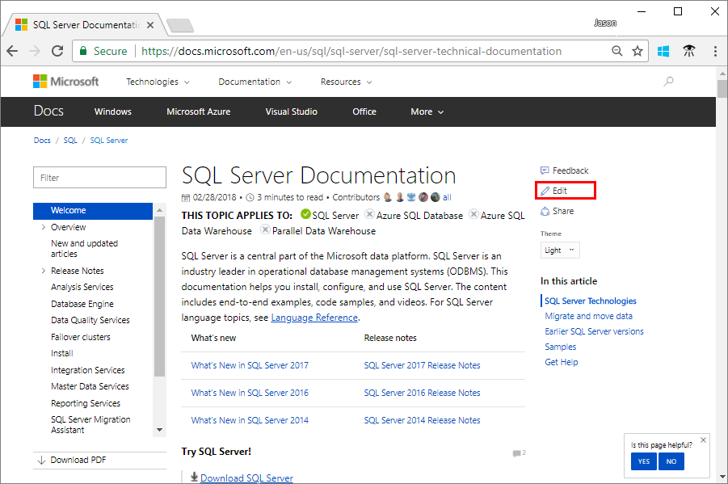

# How to contribute to SQL Server Documentation

[!INCLUDE[appliesto-ss-xxxx-xxxx-xxx-md](../includes/appliesto-ss-xxxx-xxxx-xxx-md.md)]

Anyone can contribute to SQL Server documentation. This includes correcting typos, suggesting better explanations, and improving technical accuracy. This article explains how to get started with content contributions and how the process works.

## <a id="githubui"></a> Use your browser

You can submit simple changes to articles in your browser. Every article, including this one, has an edit button on the right.



All of the content on docs.microsoft.com is managed in various GitHub Repositories. When you click the edit button, you are taken to the topic in the **sql-docs** repository. To start your edit in the browser, you have to click on the pencil icon at the top-right of the article in GitHub.


> [!NOTE]
> You must be signed in to GitHub to edit an article. If you do not have a GitHub account, see [GitHub account setup](https://docs.microsoft.com/contribute/contribute/get-started-setup-github). After creating a new account, you must also verify your email address with GitHub before you can edit.

All of the articles are written in markdown. If you need help with markdown, you can review [markdown basics](https://help.github.com/articles/getting-started-with-writing-and-formatting-on-github/) or just observe how published articles render existing markdown.

To complete your edits, you must propose your changes, create a pull request, and interact with Microsoft to review and sign off. For step-by-step instructions, see the following article:

- [GitHub contribution workflow for minor or infrequent changes](https://docs.microsoft.com/contribute/contribute/light-workflow)

## <a id="tools"></a> Use tools

Another editing option is to fork the **sql-docs** repository and clone it locally to your machine. You can then use a markdown editor and a git client to submit the changes. 

To contribute with this method, see the following articles:

- [Create a GitHub account](https://docs.microsoft.com/contribute/contribute/get-started-setup-github)
- [Install content authoring tools](https://docs.microsoft.com/contribute/contribute/get-started-setup-tools)
- [Set up a Git repository locally](https://docs.microsoft.com/contribute/contribute/get-started-setup-local)
- [Use tools to contribute](https://docs.microsoft.com/contribute/contribute/full-workflow)

If you submit a pull request with significant changes to documentation, you will get a comment in GitHub asking you to submit an online **Contribution License Agreement (CLA)**. You must complete the online form before we can accept your pull request.

> [!TIP] 
> This is a good option for large submissions, such as a change involving multiple articles. It is also useful for frequent contributors. For small or infrequent changes, [use the GitHub UI]()#githubui).


## SQL Server documentation guidance

This section provides some additional guidance on working in the **sql-docs** repository.

## Repository basics

The [sql-docs](https://github.com/MicrosoftDocs/sql-docs) repository uses several standard folders to organize the content.

| Folder | Description |
|---|---|
| [docs](https://github.com/MicrosoftDocs/sql-docs/tree/live/docs) | Contains all published SQL Server content. Subfolders logically organize different areas of the content. |
| [docs/includes](https://github.com/MicrosoftDocs/sql-docs/tree/live/docs/includes) | Contains include files. These are portions of content that can be included in one or more other topics. |
| **./media** | Contains topic images are in various **media** subfolders relative to the topic location. |
| **TOC.MD** | Table of contents file in each subfolder. |

## Applies-to includes

Each SQL Server article contains an **applies-to** include file after the title. This indicates what areas or versions of SQL Server the article applies to.

Consider the following markdown example that pulls in the **appliesto-ss-asdb-asdw-pdw-md.md** include file.

```markdown
[!INCLUDE[appliesto-ss-asdb-asdw-pdw-md](../includes/appliesto-ss-asdb-asdw-pdw-md.md)]
```

This adds the following text at the top of the article:


The following table lists current applies-to includes and their rendering.

| Applies-to include file | Rendering |
|---|---|
| appliesto-ss-asdb-asdw-pdw-md.md | [!INCLUDE[appliesto-ss-asdb-asdw-pdw-md](../includes/appliesto-ss-asdb-asdw-pdw-md.md)] |
| appliesto-ss-asdb-asdw-pdw-md.md | [!INCLUDE[appliesto-ss-asdb-asdw-pdw-md](../includes/appliesto-ss-asdb-asdw-pdw-md.md)] |
| appliesto-ss-asdb-asdw-pdw-md.md | [!INCLUDE[appliesto-ss-asdb-asdw-pdw-md](../includes/appliesto-ss-asdb-asdw-pdw-md.md)] |
| appliesto-ss-asdb-asdw-pdw-md.md | [!INCLUDE[appliesto-ss-asdb-asdw-pdw-md](../includes/appliesto-ss-asdb-asdw-pdw-md.md)] |


## Next steps

Find an article, submit a change, and help the SQL Server community. Thank you!

- [sql-docs repository](https://github.com/MicrosoftDocs/sql-docs)
- [Documentation contributor guide](https://docs.microsoft.com/en-us/contribute/)
- [Markdown basics](https://help.github.com/articles/getting-started-with-writing-and-formatting-on-github/)