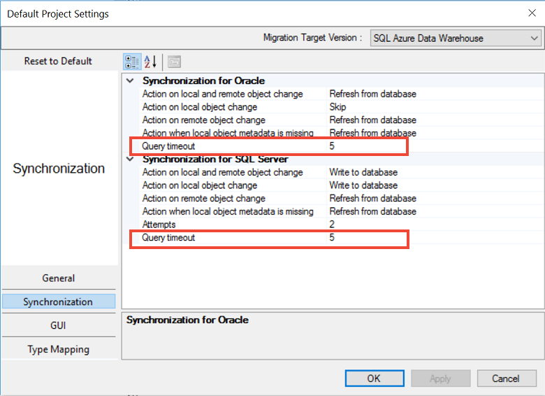

# What&#39;s New in SSMA for DB2 (DB2ToSQL)
This topic lists SSMA for DB2 changes in each release.  

## SSMA v7.4
The v7.4 release of SSMA for DB2 contains the following changes:
- The **Query timeout** option is now available during schema object discovery at source and target.

- The quality and conversion metric has been improved with targeted fixes, based on customer feedback.

> [!IMPORTANT]
> .Net 4.5.2 is a pre-requisite for installing SSMA v7.4. In addition, beginning with v7.4, the 32-bit version of SSMA is being discontinued.

## SSMA v7.3
The v7.3 release of SSMA for DB2 contains the following changes:
- Improved quality and conversion metric with targeted fixes based on customer feedback.
- SSMA extensibility framework exposed via the following items:
  - Export functionality to a SQL Server Data Tools (SSDT) project.
    -   You can now export schema scripts from SSMA to an SSDT project. You can use the schema scripts to make additional schema changes and deploy your database.

  - Libraries that can be consumed by SSMA for performing custom conversions.
    - You can now construct code that can handle custom syntax conversions and conversions that weren't previously handled by SSMA.
      - Instructions on how to construct a custom converter are available in this blog post, [Extending SQL Server Migration Assistant's conversion capabilities](https://blogs.msdn.microsoft.com/datamigration/2017/02/21/2185/).
      - Sample project for conversion can be download this [blog post](https://blogs.msdn.microsoft.com/datamigration/ssmafororacleconversionsample/).

## SSMA v7.2
The v7.2 release of SSMA for DB2 contains the following changes:
- Improved quality and conversion metric with targeted fixes based on customer feedback.
- Telemetry enhancements to provide better data points to troubleshoot customer issues and improve SSMA’s conversion rates.

## SSMA v7.1
The v7.1 release of SSMA for Access contains the following changes:
- SQL Server 2017 on Windows and Linux CTP1 is now a supported target platform for migration. This feature is in technical preview and allows schema and data movement to target SQL servers.
- SSMA now supports automatic updates to download the latest version of SSMA as soon as it is available.
- SSMA installable binaries are now delivered through Windows installer package files (.msi).

**Resources**

[Extending SQL Server Migration Assistant's conversion capabilities](https://blogs.msdn.microsoft.com/datamigration/2017/02/21/2185/)

[Assess and migrate data from non Microsoft data platforms to SQL Server *(with Oracle example)*](https://blogs.msdn.microsoft.com/datamigration/2016/11/16/sql-server-migration-assistant-how-to-assess-and-migrate-databases-from-non-microsoft-data-platforms-to-sql-server/) 

## May 2016  
The May 2016 release of SSMA for DB2 contains the following changes:  

-  Added support for SQL Server 2016.
-  Added conversion of DB2 in-memory and regular tables to SQL Server in-memory and hekaton features.
-  Added conversion of DB2 access controls to SQL Server Policy objects (Row Level Security for DB2).
-  Added conversion of DB2 system-versioned tables to SQL Server temporal tables.
-  Improved DB2 parser and resolver.
-  Removed installer check for .Net 2.0.
-  Removed unnecessary *.dll from Db2 installer.
-  Fixed "save project" and "open project" commands for SSMA Console.
-  Fixed "securepassword" command for SSMA Console.
-  Fixed counting of objects for initial loading.
-  Fixed bug in global settings.
  
## March 2016  
The March 2016 preview release of SSMA for DB2 contains the following changes:  
  
-  Added support for migration to SQL Server 2016.  
  
## January 2016  
The January 2016 maintenance release of SSMA for DB2 contains the following changes:  
  
-  Added support for a number of standard functions.  
-  Fixed DB2 Parser Errors.  
-  Fixed DB2 v9 zOS Support (RFC 5690920).  
-  Fixed DB2 unresolved identifier errors during conversion.  
-  Added View Log Menu Item to SSMA (RFC 5706203).  
-  Added Telemetry.
  
## November 2014  
The November 2014 release of SSMA for DB2 was the initial release.