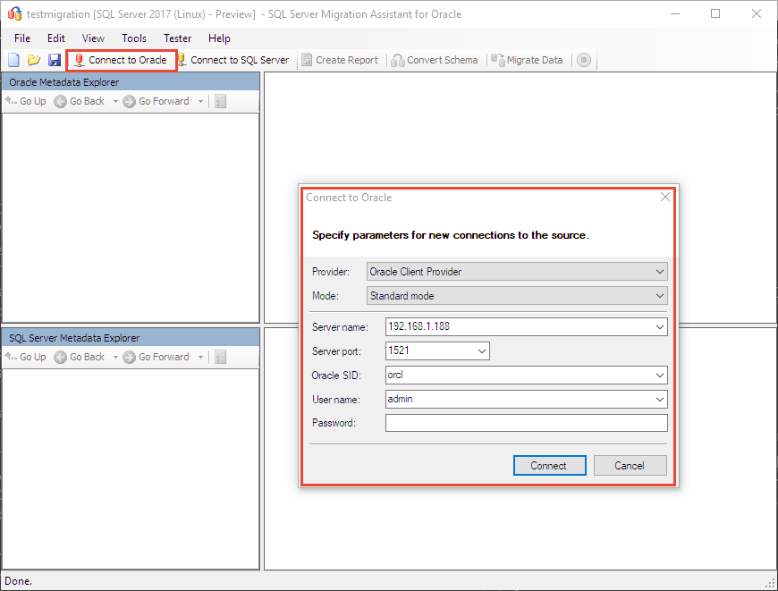
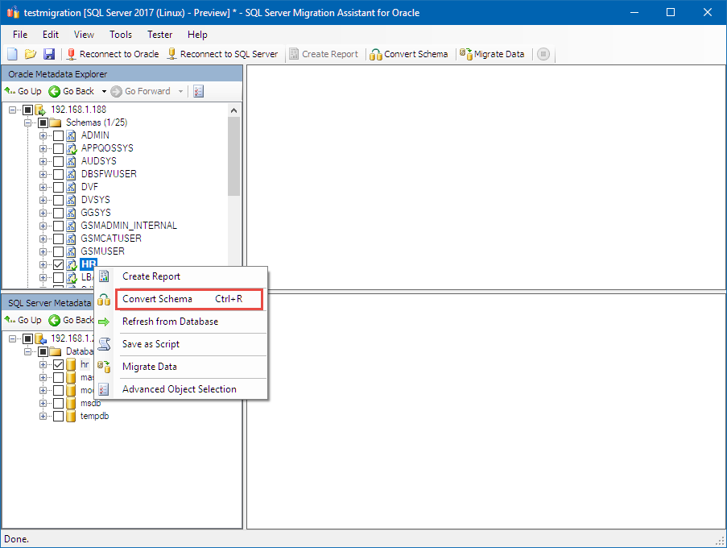
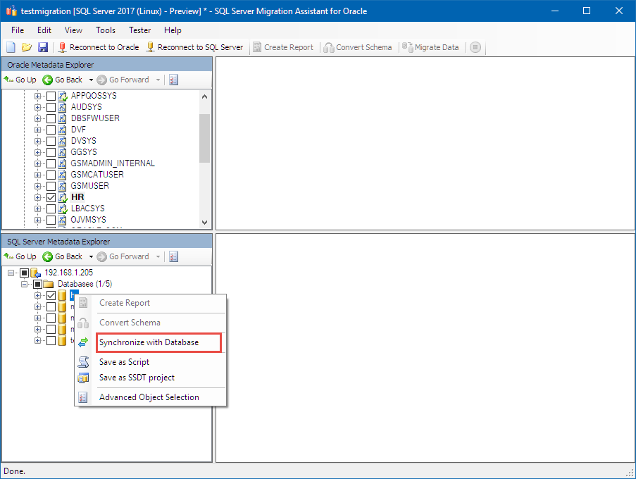

# Use the SQL Server Migration Assistant to convert Sample schema

This quick start tutorial uses SQL Server Migration Assistant (SSMA) for Oracle on Windows to convert the Oracle sample **HR** schema to a SQL Server database on Linux.

## Prerequisites

- An instance of Oracle 12c (12.2.0.1.0) with the **HR** schema installed
- A working instance of SQL Server on Linux

## Download and install SSMA for Oracle
There are several editions of SQL Server Migration Assistant available, depending on your source database.  Download the current version of [SQL Server Migration Assistant for Oracle](http://aka.ms/ssmafororacle) and install it using the instructions found on the download page.  Right now, the SSMA for Oracle Extension Pack is not supported on Linux and not necessary for this quick start. 

## Create and set-up project

1. Open SSMA for Oracle and choose New Project from the File menu.

1. Give the project a memorable name. 

1. Choose "SQL Server 2017 (Linux) - Preview" in the **Migrate To** field.

> [!IMPORTANT]
> SSMA for Oracle does not use the Oracle sample schemas by default.  To enable the HR schema, open SSMA, select the Tools drop-down and Default Project Settings.  Then choose Loading System Objects, make sure HR is checked, and choose OK.

## Connect to Oracle

Choose Connect to Oracle then enter the server name, port, Oracle SID, user name, and password, then choose connect.  In a few moments, SSMA for Oracle connects to your database and reads its metadata.

## Create a report
In the Oracle Metadata Explorer, expand your server's node, expand Schemas, right-click HR, and select Create Report.

A new browser window opens with a report that lists all of the warnings and errors associated with the conversion.  You don't need to do anything with that list for this sample.

## Connect to SQL Server
Now choose Connect to SQL Server and enter the appropriate connection information.  If you use a database name that doesn't already exist, SSMA for Oracle creates it for you.

## Convert Schema
Right-click on **HR** in **Oracle Metadata Explorer** and choose Convert Schema.

## Synchronize Database
Once the conversion is finished, use the **SQL Server Metadata Explorer** to go to the database you created in the previous step.  Right-click on it, select Synchronize With Database, and then choose OK.

## Migrate data
Back in the Oracle Metadata Explorer, right-click on **HR** and select Migrate Data.  The data migration step requires that you reenter your Oracle and SQL Server credentials.  When it's finished, a data migration report similar to the following image appears:

## Next steps

For more information on SSMA, see [SQL Server Migration Assistant](https://docs.microsoft.com/sql/ssma/sql-server-migration-assistant).

Additional information on SQL Server on Linux can be found at the [SQL Server On Linux Overview](https://docs.microsoft.com/sql/linux/sql-server-linux-overview).
