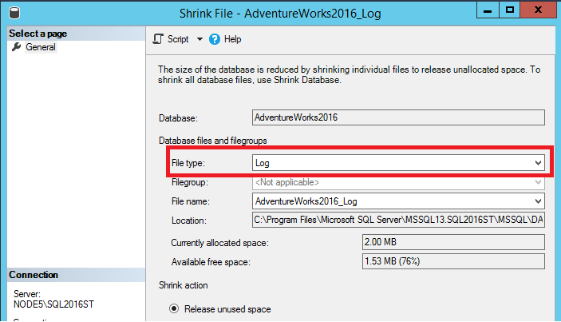
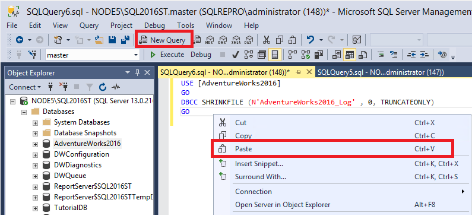
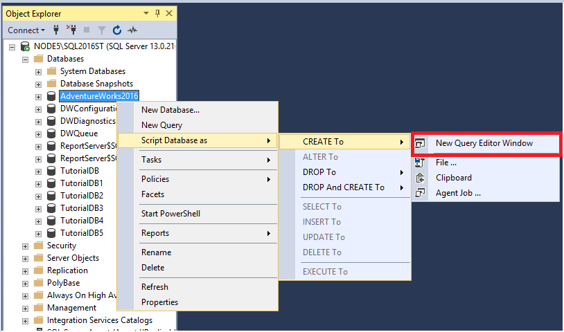

# Tutorial: Script Objects in SQL Server Management Studio
This tutorial will teach you how to generate Transact-SQL (T-SQL) scripts for various  objects found within SQL Server Management Studio.  In this tutorial, you will find examples of how to script the following objects: 

> [!div class="checklist"]
> * Queries when performing actions within the GUI
> * Databases in two different ways ("Script As" and "Generate Script")
> * Tables
> * Stored procedures
> * Extended events

The summary of this tutorial is that any object in **Object Explorer** can be scripted by right-clicking on it and selecting the **Script Object As** option. 

## Prerequisites
To complete this Tutorial, you need SQL Server Management Studio, access to a SQL Server, and an AdventureWorks database. 

- Install [SQL Server Management Studio](https://docs.microsoft.com/en-us/sql/ssms/download-sql-server-management-studio-ssms).
- Install [SQL Server 2017 Developer Edition](https://www.microsoft.com/en-us/sql-server/sql-server-downloads)
- Download an [AdventureWorks Sample Databases](https://github.com/Microsoft/sql-server-samples/releases). Instructions for restoring databases in SSMS can be found here: [Restoring a Database](https://docs.microsoft.com/en-us/sql/relational-databases/backup-restore/restore-a-database-backup-using-ssms). 

## Script Queries from GUI
Any time you perform a task using the GUI in SSMS, you can also generate the T-SQL code associated with that task. The following examples show how to do so when taking a backup of a database, and when  you shrink the transaction log.  These same steps can be applied to any action that's completed via the GUI. 

### Script T-SQL when backing up a database
1. Connect to your SQL Server.
2. Expand the **Databases** node.
3. Right-click the database > **Tasks** > **Back up**:

    

4. Configure the backup the way you want. For the purpose of this Tutorial, everything was left at default. However, any changes made in the window will also be reflected in the script. 
5. Click the option to **Script** > **Script Action to Query Window**:
 
    
6. Review the T-SQL populated in the query window: 

    

### Script T-SQL when shrinking the transaction log
1. Right-click the database > **Tasks** > **Shrink** > **Files**:

     

2. Select **Log** from the **File Type** drop down:

    

3. Click the option **Script** and **Script Action to Clipboard**:

    

4. Open a **New Query** window and paste (Right click in the window > **Paste**):

    

## Script databases
The following section teaches you how to script out the database, both using the **Script As** option and the **Generate Scripts** option.  The **Script As** option will recreate the database and the configuration options for it. The **Generate Scripts** option will script out all of the objects in the database, but not the data. To script the data as well, you will need to you use the [Import and Export Wizard](https://docs.microsoft.com/en-us/sql/integration-services/import-export-data/start-the-sql-server-import-and-export-wizard).  

### Script database using Script option
1. Connect to your SQL Server.
2. Expand the **Databases** node.
3. Right-click the database > **Script Database As**:

    

4. Review the database creation query in the window: 

    
    - This option will only script out the database configuration options.  

### Script database using Generate Scripts option
1. Connect to your SQL Server.
2. Expand the **Databases** node.
3. Right-click the database > **Tasks** > **Generate Scripts**:

    

4. Select **Next** and you'll see that you can choose to script out the entire database, or specific objects within the database: 
 
    
 
5. Select **Next**. This screen is where you can configure where the script will be saved. 
    - You can also configure advanced options by selecting **Advanced**:

    

6. Once you're ready to proceed, keep hitting **Next** until the scripts are generated and you get to the **Finish**. Your database script will be located where it was saved in Step 5. 
    - This will script out the schema and various objects within the database, but not the data. 
 
## Script Tables
This section covers how to script out tables from your database.

1. Connect to your SQL Server.
2. Expand your **Databases** node.
3. Expand your **AdventureWorks** database node. 
4. Expand your **Tables** node.
5. Right-click the table you want to script out > **Script Table as**
    - From here, there are various options such as creating the table, or inserting data into it: 
    
    
 
## Script Stored Procedures
This section covers how to script out stored procedures. 

1. Connect to your SQL Server.
2. Expand your **Databases** node.
3. Expand your **Programmability** node. 
4. Expand your **Stored Procedure** node.
5. Right-click the stored procedure you're interested in > **Script Stored Procedure As**
    
    

## Script Extended Events
This section covers how to script out [extended events](https://docs.microsoft.com/en-us/sql/relational-databases/extended-events/extended-events). 

1. Connect to your SQL Server.
2. Expand your **Management** node.
3. Expand your **Extended Events** node.
4. Expand your **Sessions** node.
5. Right-click the extended session you're interested in > **Script Session As**:

     

## Next steps
The next article will introduce you to the pre-built templates found within SSMS. 

Advance to the next article to learn more
> [!div class="nextstepaction"]
> [Next steps button](templates-ssms.md)

