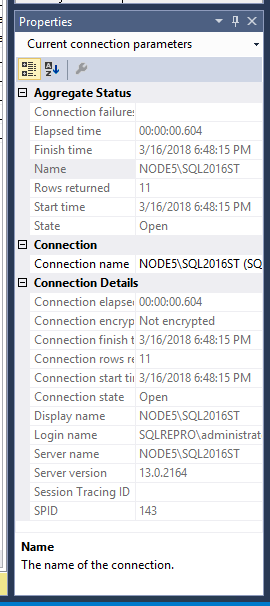
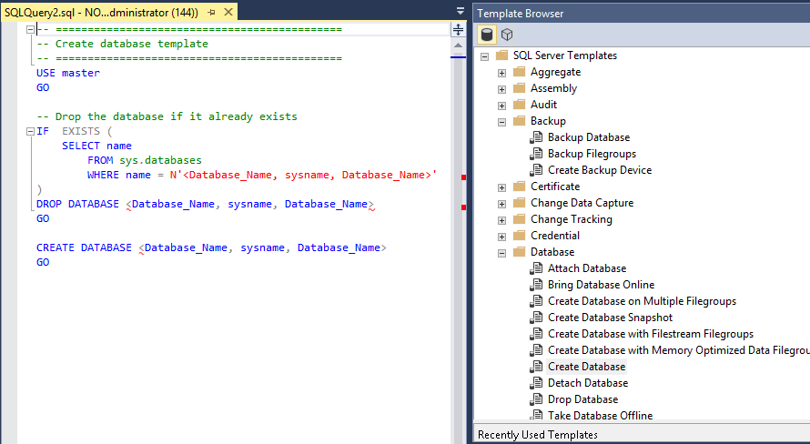
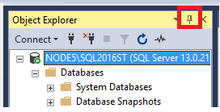
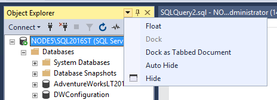
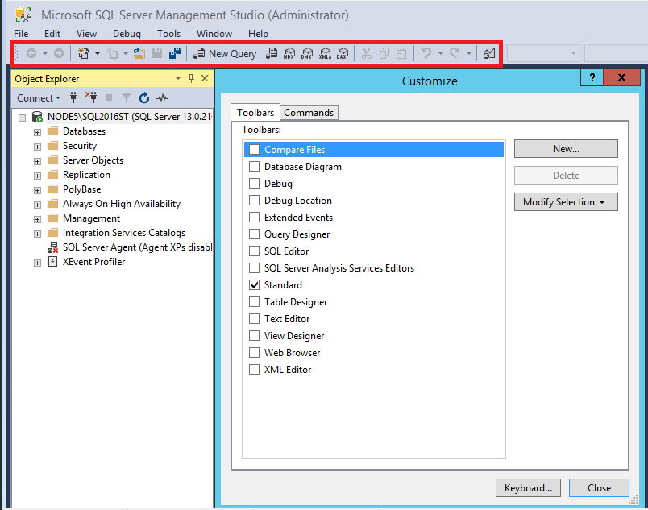

# Tutorial: SQL Server Management Studio components and configuration
This tutorial describes the various window components in SQL Server Management Studio (SSMS), and some basic configuration options for your workspace. In this article, you learn about: 

> [!div class="checklist"]
> * The various components that make up the SSMS environment
> * Changing the environmental layout, and resetting it to default
> * Maximizing the query editor
> * Changing the font 
> * Configuring startup options 
> * Resetting the configuration to default 

## Prerequisites
To complete this tutorial, you need SQL Server Management Studio.  

- Install [SQL Server Management Studio](https://docs.microsoft.com/en-us/sql/ssms/download-sql-server-management-studio-ssms).

## SQL Server Management Studio components
This section describes the various window components that are available in the workspace, and how to use them. 

- To close a window, select the **X** in the right corner of the title bar. To reopen a window, select the window in the **View** menu. 

    

- **Object Explorer** (F8): Object Explorer is a tree view of all the database objects in a server. This view includes the databases of the SQL Server Database Engine, Analysis Services, Reporting Services, and Integration Services. Object Explorer includes information for all servers that are connected to it. 
    
    
- **Query Window** (Ctrl+N): After you select **New Query**, you enter your Transact-SQL (T-SQL) queries in this window. Results of your queries also appear here.
    
    

- **Properties** (F4): You can see the **Properties** view when the **Query Window** is open. The view displays basic properties of the query. For example, it shows the time that a query started, the number of rows returned, and connection details.  

    

- **Template Browser** (Ctrl+Alt+T): You'll find various pre-built T-SQL templates in the template browser. You can use these templates to perform various functions, such as creating or backing up a database. 

    

- **Object Explorer Details**(F7): This view is more granular than what's visible in Object Explorer. You can use **Object Explorer Details** to manipulate multiple objects at the same time. For example, in this window, you can select multiple databases, and then either delete them or script them out simultaneously. 

     
 
    

## Change the environmental layout 
This section describes how to change the environmental layout, such as how to move various windows. 

- To move a window, hold down the title and drag the window. 
- To pin or unpin a window, select the pushpin icon in the title bar:
    
    

- Each window component has a drop-down arrow that you can use to manipulate the window in various ways: 

    

- When you have two or more query windows open, they can be tabbed vertically or horizontally so that both query windows are visible at once. To achieve this, right-click the title of the query and select the desired tabbed option. 
 
    

    - This is the **Horizontal Tab Group**:
         
    
    - This is the **Vertical Tab Group**:  
        
        

    - To merge the tabs back again, right-click the query title again and **Move to Next Tab Group**  or **Move to Previous Tab Group**:
    
        

- To restore the default environmental layout, click on the **Window Menu** > **Reset Window Layout**:
 
    
    
## Maximize Query Editor
The query editor can be maximized to full-screen mode.

1. Click anywhere in the Query Editor Window.
2. Press SHIFT + ALT + ENTER to toggle between full-screen mode and regular mode. 

This keyboard shortcut works with any document window. 

## Change basic settings
This section describes how to modify some basic settings in SSMS from the **Tools** menu:

  

- To modify the highlighted toolbar, select **Tools** > **Customize**:

    

### Change the font
- To change the font, select **Tools** > **Options** > **Fonts and Colors**:

     

### Change startup options
- Startup options determine what your workspace looks like when you first open SSMS. To change startup options, select **Tools** > **Options** > **Startup**:
 
    

### Reset settings to the default
- All of these settings can be exported and imported from the menu. To import or export settings, or to restore default settings, select **Tools** > **Import and Export Settings** 

    

## Next steps
The next article teaches you some additional tips and tricks for using SSMS, such as how to find your SQL Server error log and your SQL instance name. 

Advance to the next article to learn more
> [!div class="nextstepaction"]
> [Next steps button](ssms-tricks.md)
 
 

