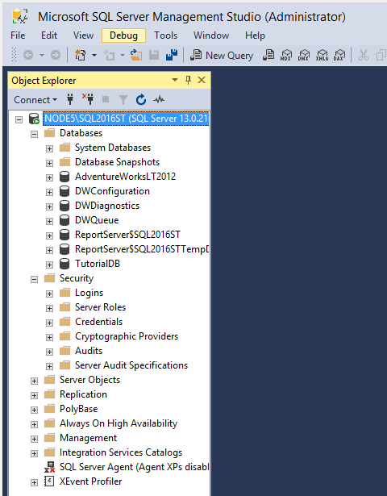
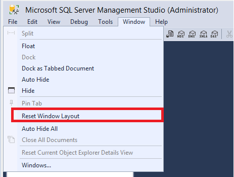
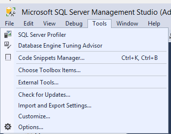
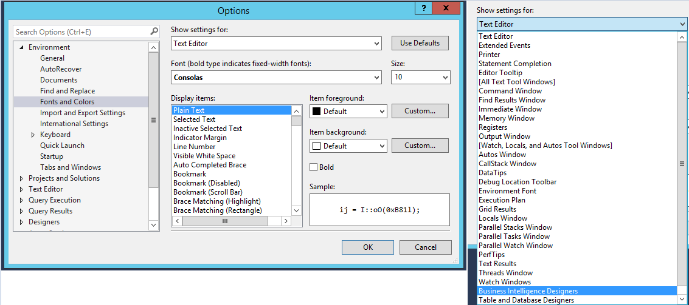

# Tutorial: SQL Server Management Studio Components and Configuration
This Tutorial describes the  different window components within SQL Server Management Studio (SSMS) and some basic configuration options for your workspace. In this article, you will learn how about: 

> [!div class="checklist"]
> * The different components that make up the SSMS environment
> * Changing the environmental layout and resetting it to default
> * Maximizing the query editor
> * Changing some basic settings such as
> *  - Changing the font
> *  - Configuring startup options
> *  - Resetting the configuration back to default

## Prerequisites
To complete this Tutorial, you need SQL Server Management Studio.  

- Install [SQL Server Management Studio](https://docs.microsoft.com/en-us/sql/ssms/download-sql-server-management-studio-ssms).

## SQL Server Management Studio Components
This section covers the different window components available in the workspace, and their purpose. 

- Every window component can be closed by hitting the X in the corner of the title bar and then reopened from the **View** dropdown in the main menu. 

    

- **Object Explorer** (F8): Object Explorer is a tree view of all the database objects in a server. This can include the databases of the SQL Server Database Engine, Analysis Services, Reporting Services, and Integration Services. Object Explorer includes information for all servers to which it is connected. 
    
    
- **Query Window** (Ctrl+N): Once you've clicked on **New Query**, this is the window where you will type in your Transact-SQL (T-SQL) queries. Results of your queries are visible here as well.
    
    

- **Properties** (F4): This is visible once the **Query Window** is open and displays basic properties of the query. For example, it will show the time a query started, the number of rows returned, and connection details.  

    

- **Template Browser** (Ctrl+Alt+T): There are a number of pre-built T-SQL Templates that can be found in the template browser. These templates allow you to perform various functions such as creating or backing up a database. 

    

- **Object Explorer Details**(F7): This is a more granular view of what's visible in the Object Explorer, and allows you to manipulate multiple objects at once. For example, the Object Explorer Details window allows you to select multiple databases simultaneously and either delete them or script them out. 

     
 

    

## Changing the Environmental Layout 
This section discusses manipulating the environmental layout, such as moving the various windows around. 

-  Each window component can be moved around by holding down the title and dragging the window around. 
- Each window component can be pinned and unpinned by selecting the pushpin icon in the title bar:
    
    

- Each window component has a drop-down arrow that allows for the window to be manipulated in various ways: 

    

- Once you have two or more query windows open, they can be tabbed vertically or horizontally so that both query windows are visible at once. To achieve this, right-click the title of the query and select the desired tabbed option. 
 
    

    - This is the **Horizontal Tab Group**:
         
    
    - This is the **Vertical Tab Group**:  
        
        

    - To merge the tabs back again, right-click the query title again and **Move to Next Tab Group**  or **Move to Previous Tab Group**:
    
        

- To restore the default environmental layout, click on the **Window Menu** > **Reset Window Layout**:
 
    
    
## Maximizing Query Editor
The query editor can be maximized to full screen mode.

1. Click anywhere within the Query Editor Window.
2. Press SHIFT + ALT + ENTER to toggle between full-screen mode and regular mode. 

This keyboard shortcut works with any document window. 

## Changing Basic Settings
This section discusses how to modify some basic settings within SSMS. These options are found within the **Tools** menu option:

  

- The highlighted toolbar can be modified by going to the menu: **Tools** > **Customize**:

    

- The font can be changed from the menu: **Tools** > **Options** > **Fonts and Colors**:

     

- The startup options determine what your workspace looks like when you first launch SSMS. These can be configured from the menu: **Tools** > **Options** > **Startup**:
 
    

- All of these settings can be exported and imported from the menu: **Tools** > **Import and Export Settings** 

    
    - This is also where you can reset all of your settings to default. 

