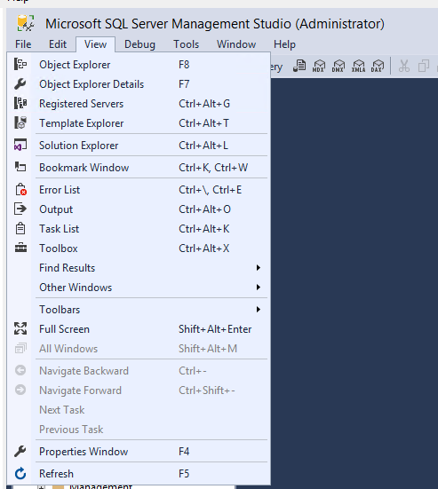
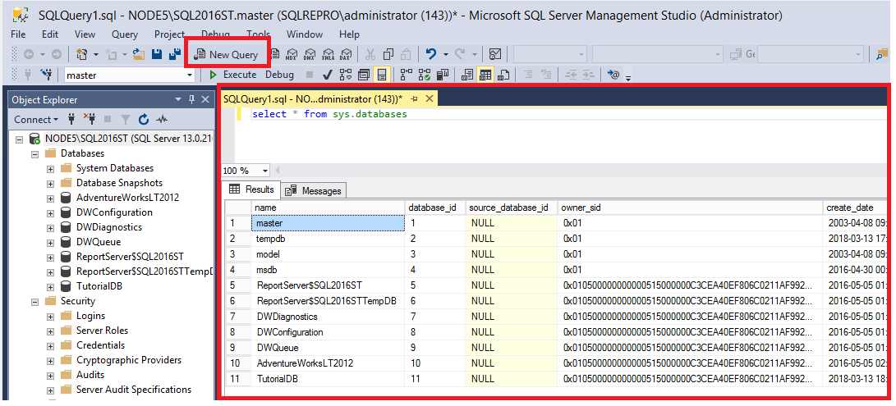
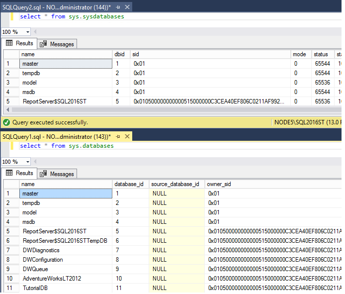
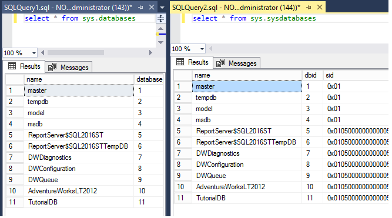

# Tutorial: SQL Server Management Studio components and configuration
This tutorial describes the various window components in SQL Server Management Studio (SSMS), and some basic configuration options for your workspace. In this article, you learn how to: 

> [!div class="checklist"]
> * Identify the components that make up the SSMS environment
> * Change the environment layout, and reset it to the default
> * Maximize the query editor
> * Change the font 
> * Configure startup options 
> * Reset the configuration to the default 

## Prerequisites
To complete this tutorial, you need SQL Server Management Studio.  

- Install [SQL Server Management Studio](https://docs.microsoft.com/sql/ssms/download-sql-server-management-studio-ssms).

## SQL Server Management Studio components
This section describes the various window components that are available in the workspace, and how to use them. 

- To close a window, select the **X** in the right corner of the title bar. 
- To reopen a window, select the window in the **View** menu. 

    

- **Object Explorer** (F8): Object Explorer is a tree view of all the database objects in a server. This view includes the databases of the SQL Server Database Engine, SQL Server Analysis Services, SQL Server Reporting Services, and SQL Server Integration Services. Object Explorer includes information for all servers that are connected to it. 
    
    
- **Query Window** (Ctrl+N): After you select **New Query**, enter your Transact-SQL (T-SQL) queries in this window. The results of your queries also appear here.
    
    

- **Properties** (F4): You can see the Properties view when the Query Window is open. The view displays basic properties of the query. For example, it shows the time that a query started, the number of rows returned, and connection details.  

    

- **Template Browser** (Ctrl+Alt+T): Template Browser has various pre-built T-SQL templates. You can use these templates to perform various functions, such as creating or backing up a database. 

    

- **Object Explorer Details**(F7): This view is more granular than what's visible in Object Explorer. You can use Object Explorer Details to manipulate multiple objects at the same time. For example, in this window, you can select multiple databases, and then either delete them or script them out simultaneously. 

     
 
    

## Change the environment layout 
This section describes how to change the environment layout, such as how to move various windows. 

- To move a window, press and hold the title, and then drag the window. 
- To pin or unpin a window, select the pushpin icon in the title bar:
    
    

- Each window component has a drop-down menu that you can use to manipulate the window in various ways: 

    

- When two or more query windows are open, the windows can be tabbed vertically or horizontally so that both query windows are visible at once. To do this, right-click the title of the query, and then select the tabbed option that you want. 
 
    

    - Here's a Horizontal Tab Group:

           
    
    - Here's a Vertical Tab Group:

      
        
    - To merge the tabs back again, right-click the query title, and then select **Move to Next Tab Group**  or **Move to Previous Tab Group**:
    
      

- To restore the default environment layout, select **Window Menu** > **Reset Window Layout**:
 
    
    
## Maximize Query Editor
Query Editor can be maximized to full-screen mode.

1. Click anywhere in the Query Editor window.
2. Press Shift+Alt+Enter to toggle between full-screen mode and regular mode. 

This keyboard shortcut works with any document window. 

## Change basic settings
This section describes how to modify some basic settings in SSMS from the **Tools** menu:

  

- To modify the highlighted toolbar, select **Tools** > **Customize**:

    

### Change the font
- To change the font, select **Tools** > **Options** > **Fonts and Colors**:

     

### Change startup options
- Startup options determine what your workspace looks like when you first open SSMS. To change startup options, select **Tools** > **Options** > **Startup**:
 
    

### Reset settings to the default
- You can export and import all these settings from the menu. To import or export settings, or to restore default settings, select **Tools** > **Import and Export Settings** 

    

## Next steps
The next article teaches you some additional tips and tricks for using SSMS, such as how to find your SQL Server error log and your SQL instance name. 

Go to the next article to learn more.
> [!div class="nextstepaction"]
> [Next steps button](ssms-tricks.md)
 
 

