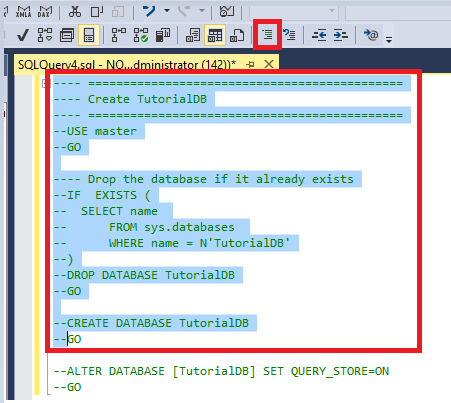
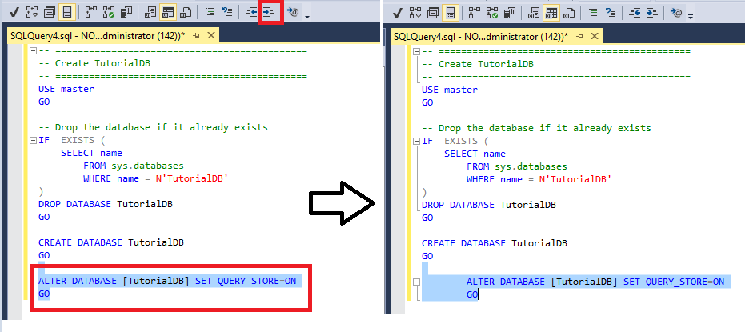
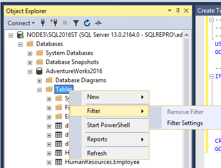
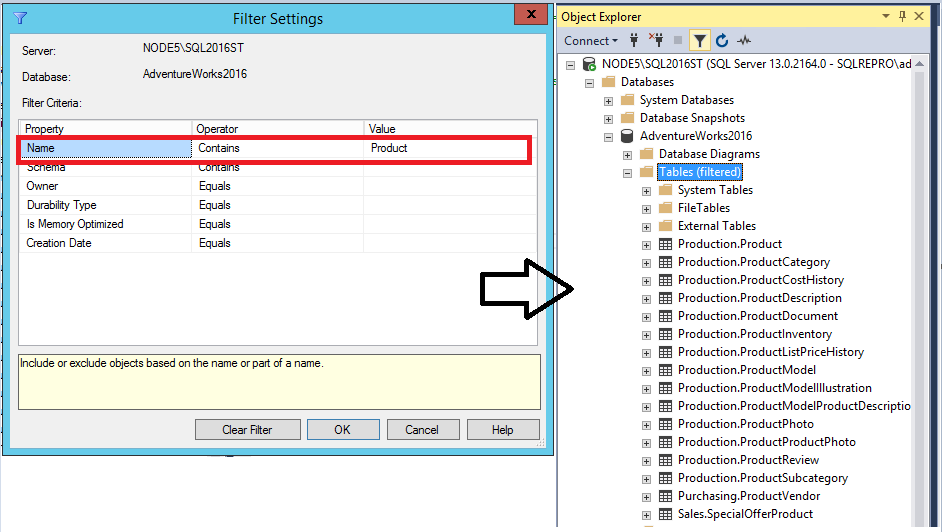
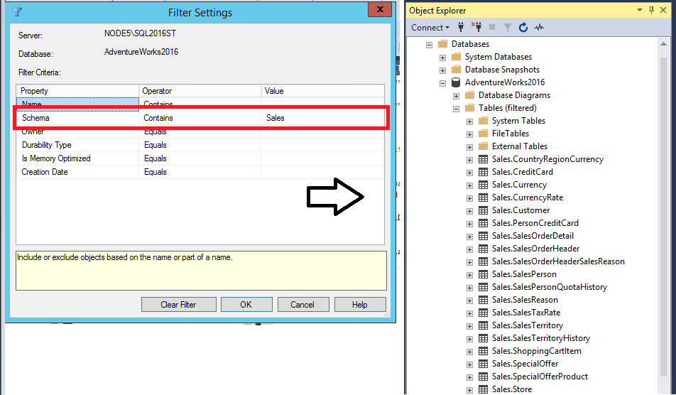
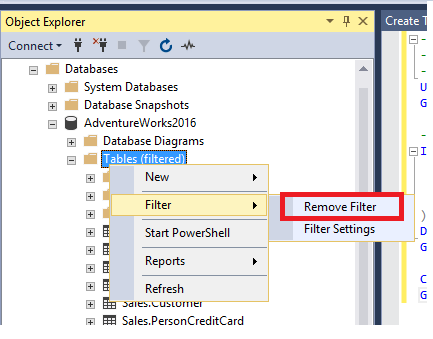
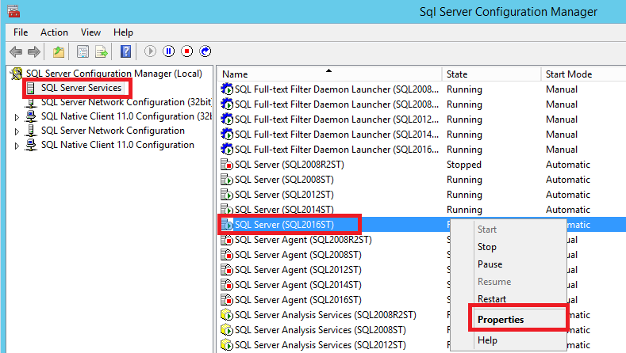
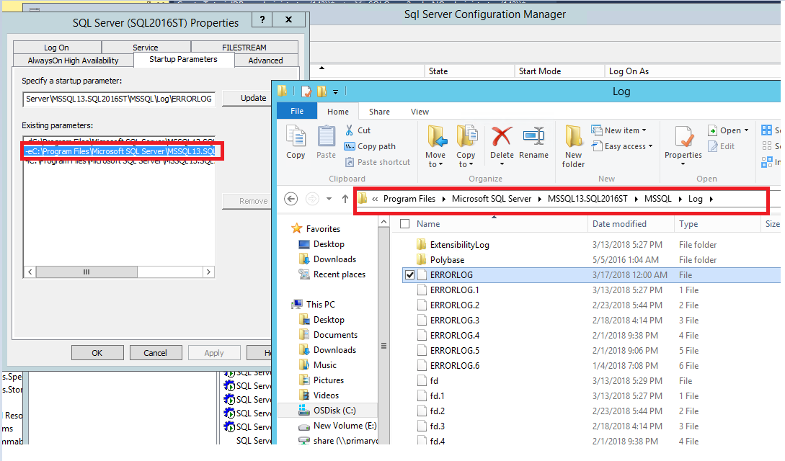

# Tutorial: Additional Tips and Tricks for using SSMS
This tutorial will provide you with some additional tricks for using SQL Server Management Studio. This article will teach you how to: 

> [!div class="checklist"]
> * Comment / Uncomment your Transact-SQL (T-SQL) text
> * Indent your text
> * Filter Objects in Object Explorer
> * Access your SQL Server Error log
> * Find the name of your SQL Server Instance

## Prerequisites
To complete this Tutorial, you need SQL Server Management Studio, access to a SQL Server, and an AdventureWorks database. 

- Install [SQL Server Management Studio](https://docs.microsoft.com/en-us/sql/ssms/download-sql-server-management-studio-ssms).
- Install [SQL Server 2017 Developer Edition](https://www.microsoft.com/en-us/sql-server/sql-server-downloads)
- Download an [AdventureWorks Sample Databases](https://github.com/Microsoft/sql-server-samples/releases). 
    - Instructions for restoring databases in SSMS can be found here: [Restoring a Database](https://docs.microsoft.com/en-us/sql/relational-databases/backup-restore/restore-a-database-backup-using-ssms). 

## Commenting / Uncommenting your T-SQL
Portions of your text can be commented and uncommented by using the comment button in the toolbar. Text that is commented out will not be executed. 

1. Open SQL Server Management Studio. 
2. Connect to your SQL Server.
3. Open a **New Query** window. 
4. Paste the following T-SQL code snippet into your text window: 

  ```sql
    USE master
    GO

    -- Drop the database if it already exists
    IF  EXISTS (
	    SELECT name 
		    FROM sys.databases 
		    WHERE name = N'TutorialDB'
            )

    DROP DATABASE TutorialDB
    GO

    CREATE DATABASE TutorialDB
    GO

    ALTER DATABASE [TutorialDB] SET QUERY_STORE=ON
    GO
 ``` 


5. Highlight the **Alter Database** portion of the text and click **Comment** in the toolbar: 

    
6. Click **Execute** to run the uncommented portion of the text. 
7. Highlight everything other than the **Alter Database** command and click **Comment** in the toolbar:

    

8. Highlight the **Alter Database** portion and click **Uncomment** to uncomment it:

    
    
9. Click **Execute** to run the uncommented portion of the text 

## Indent your Text
The indentation buttons allow you to increase and decrease the indent of your text. 

1. Open a **New Query** window. 
2. Paste the following T-SQL code snippet into your text window: 

  ```sql
  USE master
GO

-- Drop the database if it already exists
IF  EXISTS (
	SELECT name 
		FROM sys.databases 
		WHERE name = N'TutorialDB'
)
DROP DATABASE TutorialDB
GO

CREATE DATABASE TutorialDB
GO

ALTER DATABASE [TutorialDB] SET QUERY_STORE=ON
GO
 ``` 
2. Highlight the **Alter Database** portion of the text and press **Increase Indent** in the toolbar to move this text forward

    

3. Highlight the **Alter Database** portion of the text again and this time click **Decrease Indent** to move this text back. 
    


## Filtering Objects in Object Explorer
When a database has many objects, finding a specific object can prove difficult. To make this easier, you have the ability to filter objects. This section explains how to filter tables, but the same steps can be applied to any other node within **Object Explorer**

1. Connect to your SQL Server.
2. Expand your **Databases** node.
3. Expand your **AdventureWorks** database node. 
4. Expand your **Tables** node. 
   - You'll notice that you can see all the tables that are present in the database.
5. Right Click the **Tables** node > **Filter** > **Filter Settings**:

    

6. In the Filter Settings window, you can modify filter settings. A few examples:
    - Filter by name: 
   
    - Filter by schema: 
    

7. To clear the filter, right-click **Tables** > **Remove Filter**

    
    


## Accessing your SQL Server Error log
The error log is a file that contains details about things occurring within your SQL Server. It can be browsed and queried within SSMS. It can also be found as a .log file on disk.

### Finding your error log if you cannot connect to SQL
1. Open your SQL Server Configuration Manager. 
2. Expand the **Services** node.
3. Right click on your SQL Server instance > **Properties**:

    

4. Select the **Startup Parameters** tab.
5. In the **Existing Parameters** area, the path after the "-e" is the location of the error log: 
    
    
    - You'll notice that there are several errorlog.* in this location. The one ending with *.log is the current one. The ones ending with numbers are previous logs, as a new log is created every time the SQL Server restarts. 
6. Open this file in Notepad. 

### Finding your error log if you're connected to SQL
1. Connect to  your SQL Server
2. Open a **New Query** window 
3. Paste the following T-SQL code snippet into your query window and click **Execute**:


  ```sql
   SELECT SERVERPROPERTY('ErrorLogFileName') AS 'Error log file location' 
  ```
3. The results show you the location of the error log within the file system: 


### Open Error log within SSMS
1. Connect to your SQL Server.
2. Expand the **Management** node. 
3. Expand the **SQL Server Logs** node. 
4. Right-click the **Current** error log > **View SQL Server Log**:

    

### Query error log within SSMS
1. Connect to your SQL Server
2. Open a **New Query** window
3. Paste the following T-SQL code snippet into your query Window:

 ```sql
   sp_readerrorlog 0,1,'Server process ID' 
  ``` 
4. Modify the text in the single quotes to text of interest.
5. Execute the query and review the results:
   
    

## Determine SQL Server Instance Name..
There are different ways to determine the name of your instance before and after you connect to your SQL Server.  

### ...When you don't know it
1. Follow the steps to locate the [SQL Server Error log on disk.](#finding-your-error-log-if-you-cannot-connect-to-sql) 
2. Open the errorlog.log in Notepad. 
3. Navigate through it until you find the text "Server name is"
  - Whatever is listed in the single quotes is the name of the instance and what you'll be connecting to: 
    

### ...Once you're connected
There are three places to find which instance you're connected to. 

1. The name of the server will be listed in **Object Explorer**

    
2. The name of the server will be listed in the query window:

    
3. . The name of the server will also be listed in the **Properties window**.
    - To access this open the **View** Menu > **Properties Window**

    

### ...If you're connected to an Alias or Availability Group Listener 
When you're connected to an alias or an Availability Group listener, then that's what will show up **Object Explorer** and **Properties**. In this case, the SQL Server name may not be readily apparent, and must be queried. 

1. Connect to SQL Server.
2. Open a **New Query** window.
3. Paste the following T-SQL Code snippet into the window: 

  ```sql
   select @@Servername 
 ``` 
4. View the results of the query to identify the name of the SQL Server you're connected to: 
    
    


