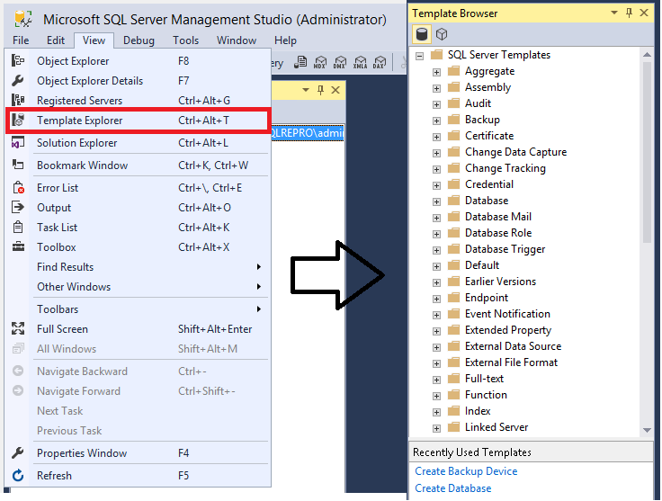
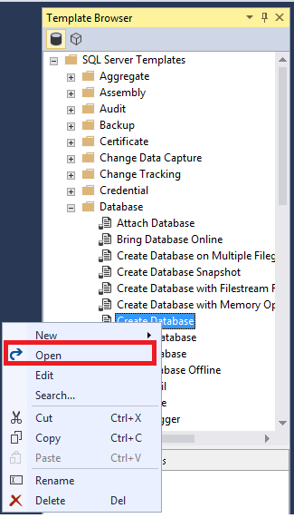
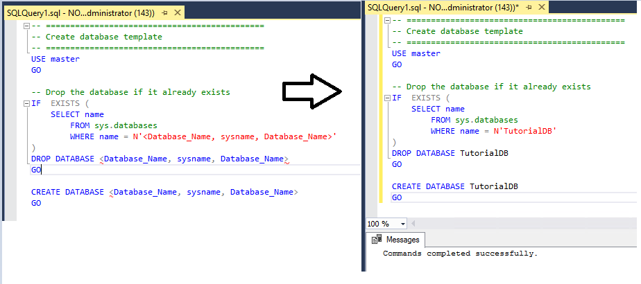
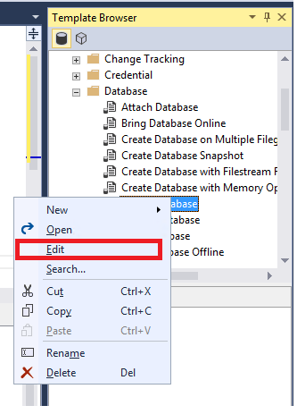
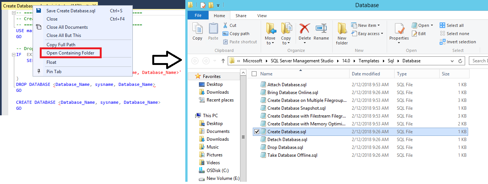
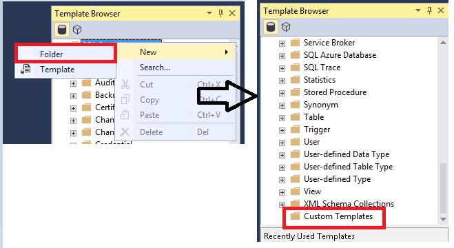
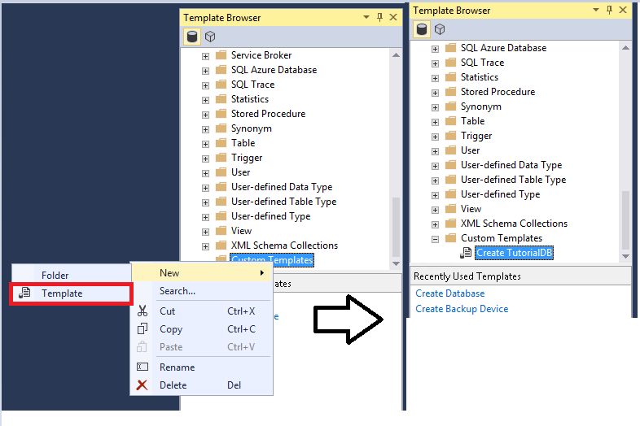

# Tutorial: Using templates in SQL Server Management Studio
This tutorial introduces you to the pre-built Transact-SQL (T-SQL) templates that are available in SQL Server Management Studio (SSMS). In this article, you learn how to:

> [!div class="checklist"]
> * Use the template browser to generate T-SQL scripts
> * Edit an existing template 
> * Locate the templates on disk
> * Create a new template
   

## Prerequisites
To complete this tutorial, you need SQL Server Management Studio and access to a SQL server. 

- Install [SQL Server Management Studio](https://docs.microsoft.com/en-us/sql/ssms/download-sql-server-management-studio-ssms).
- Install [SQL Server 2017 Developer Edition](https://www.microsoft.com/en-us/sql-server/sql-server-downloads).

 

## Using Template Browser
In this section, you learn how to locate and use **Template Browser**. 

1. Open SQL Server Management Studio.
2. In the **View** menu, select **Template Browser** (Ctrl + Alt + T): 

    
    - You can see recently used templates at the bottom of **Template Browser**.

3. Expand the node you're interested in. Right-click the template, and then select **Open**:

    
    - Double-clicking the template has the same effect.

4. A new query window opens, with the T-SQL already populated. 
5. Modify the template to suit your needs, and then select **Execute** to run the query:
    
    

## Edit an existing template
You can also edit the existing templates in **Template Browser**.  

1. In **Template Browser**, go to the template you want to work with.
2. Right-click the template, and then select **Edit**:

    

3. Make the changes you want to make in the query window that opens.
4. To save the template, select **File** > **Save** (Ctrl + S).
5. Close the query window.
6. Reopen the template. Your edits should be there.
 

## Locate a template on disk
When a template is open, you can locate the template on disk.

1. In **Template Browser**, select a template, and then select **Edit**.
2. Right-click **Query Title**, then select **Open Containing Folder**. 
The explorer should open where the templates are stored on disk: 

   
  

## Create a new template
You can also create a new template in **Template Browser**. The following steps teach you to create a new folder, and then create a new template within that folder. You can also use these steps to create a custom template within existing folders. 

1. Open **Template Browser**.
2. Right-click **SQL Server Templates**, then select **New** > **Folder**.
3. Name this folder **Custom Templates**:

    

4. Right-click the newly created **Custom Templates**, then select **New** > **Template**. Enter a name for your template:
 
    
   
5. Right-click the template you created, and then select **Edit**. A **New Query Window** opens.
6. Enter the T-SQL text that you want to save. 
7. In the **File** menu, select **Save**.
8. Close the existing **Query Window**, and then open your new custom template. 

    

## Next steps
The next article provides additional tips and tricks for using SQL Server Management Studio. 

Advance to the next article to learn more
> [!div class="nextstepaction"]
> [Next steps button](ssms-tricks.md)
